<p align="center">
  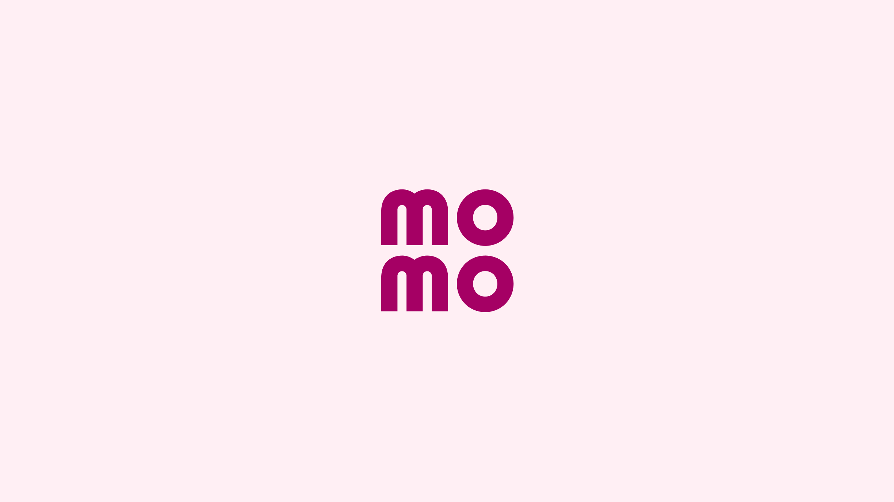
</p>

<h1 align="center">MoMo VN — Self-Serve Hybrid Data Platform</h1>

<p align="center">
  <em>A reference data-platform solution for Vietnam's #1 fintech super-app — from business case, to solution design, to runnable engineering samples.</em>
</p>

<p align="center">
  
  <br/>
  <sub>MoMo — "Trợ Thủ Tài Chính với AI" (AI Financial Assistant). Brand visual © M_Service / MoMo. Used here for educational illustration only.</sub>
</p>

---

> **What this repo is.** An anonymized, educational **end-to-end data platform blueprint** for a company shaped like MoMo (M_Service): a 30M+ user e-wallet and financial-services super-app. It walks from the **business** (why a data platform), through **solution design** (a next-gen self-serve hybrid multi-cloud lakehouse), down to **engineering code samples** (ingestion, transformation, streaming, data quality, orchestration, ML feature/credit pipelines).
>
> **What this repo is not.** It contains **no** confidential MoMo data, internal architecture, or production credentials. All numbers, schemas, and pipelines are composite and illustrative, reconstructed from public job descriptions and public product information.

| Meta | Value |
|------|-------|
| **Company shape** | Fintech super-app — e-wallet, payments, lending, insurance, investment, loyalty |
| **Scale (illustrative)** | 30M+ users · billions of events/day · 1–2M+ real-time risk checks/day |
| **North star** | *"Let everyone do more with their money"* — AI-first, self-serve data |
| **Cloud** | Hybrid **multi-cloud** (GCP **BigQuery** + AWS) + on-prem Kubernetes |
| **Core stack** | Spark · Flink · Kafka · StarRocks · ClickHouse · DuckDB · BigQuery · Airflow · n8n · dbt/semantic layer · Superset / Looker / Data Studio |
| **Consumers** | Business & Product analytics · Risk/Fraud · Credit scoring · Personalization · FinOps |

---

## Table of contents

1. [Business — why MoMo needs a data platform](#1-business--why-momo-needs-a-data-platform)
2. [Product surface that generates the data](#2-product-surface-that-generates-the-data)
3. [Solution design — the self-serve hybrid platform](#3-solution-design--the-self-serve-hybrid-platform)
4. [Data domains & modeling](#4-data-domains--modeling)
5. [ML & AI data products](#5-ml--ai-data-products)
6. [Engineering code samples](#6-engineering-code-samples)
7. [Data governance, quality & FinOps](#7-data-governance-quality--finops)
8. [Team, org & role mapping](#8-team-org--role-mapping)
9. [Repo map](#9-repo-map)

---

## 1. Business — why MoMo needs a data platform

MoMo is no longer "just an e-wallet" — it is positioned as an **AI Financial Assistant** spanning payments, transfers, bill pay, lending (*Ví Trả Sau*, *Vay Nhanh*), insurance (*Bảo Hiểm*), investment (*Túi Thần Tài*), e-commerce, gaming, movie/bus tickets, and merchant loyalty (*MoMo Xu*). Every one of those surfaces emits high-volume events that must become **trustworthy data** for decisions.

### 1.1 Business drivers

| Driver | What the business needs | Data-platform implication |
|--------|-------------------------|---------------------------|
| **AI-first product** | AI in every small interaction (protect money, simplify finance) | Low-latency features, online + offline parity |
| **Financial services growth** | Credit scoring, BNPL approval, collections | Governed, auditable, explainable data |
| **Real-time risk & fraud** | Block fraud *before* settlement | Streaming pipelines, 1–2M+ checks/day |
| **Personalization** | Recommend services, targeted promotions | User 360, behavioral features, A/B tests |
| **Self-serve analytics** | Business/Product answer their own questions | Semantic layer, governed marts, BI |
| **Cost control** | Multi-cloud spend visibility | FinOps lineage: cost per team/project |

### 1.2 Pain points without a platform

| Pain | Business impact | Engineering symptom |
|------|-----------------|---------------------|
| Per-team data silos | Conflicting numbers in exec reviews | 5 teams, 5 definitions of "active user" |
| Batch-only T+1 | Fraud detected after money moves | No streaming; overnight Spark only |
| No single source of truth | Re-derived metrics, low trust | Ad-hoc SQL copied between notebooks |
| Manual, brittle ingestion | Late dashboards, missed campaigns | Cron scripts, no DQ gates, no lineage |
| Opaque cost | Cloud bill shock, no accountability | Cannot attribute spend to a team/job |
| Slow access for partners | Merchants/partners wait for data | No self-serve datasets or APIs |

**Executive one-liner**

> *We cannot scale an AI-first financial super-app on per-team batch silos. We need a governed, self-serve, hybrid-cloud platform where ingestion, quality, modeling, and cost are first-class — so risk, credit, personalization, and the business can all trust the same data.*

Full narrative: [`docs/01-business-context.md`](docs/01-business-context.md)

### 1.3 Stakeholder landscape

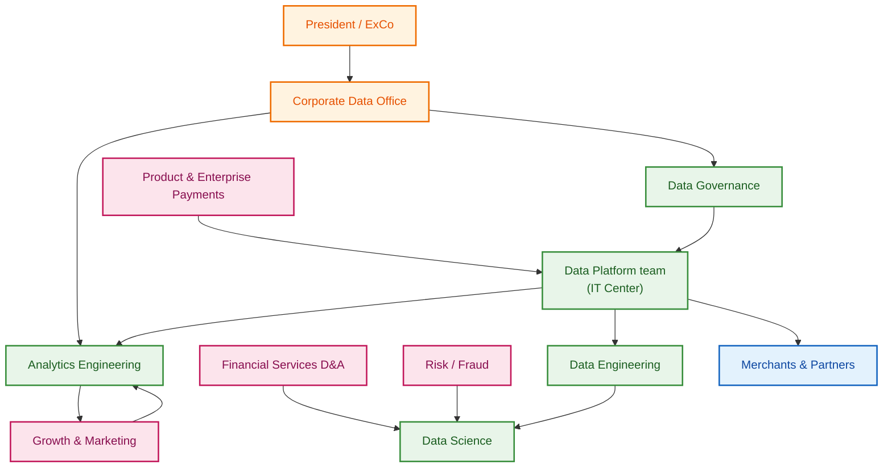

---

## 2. Product surface that generates the data

The platform exists to turn product activity into decisions. A few real MoMo surfaces (brand assets © M_Service / MoMo, educational use):

<p align="center">
  
  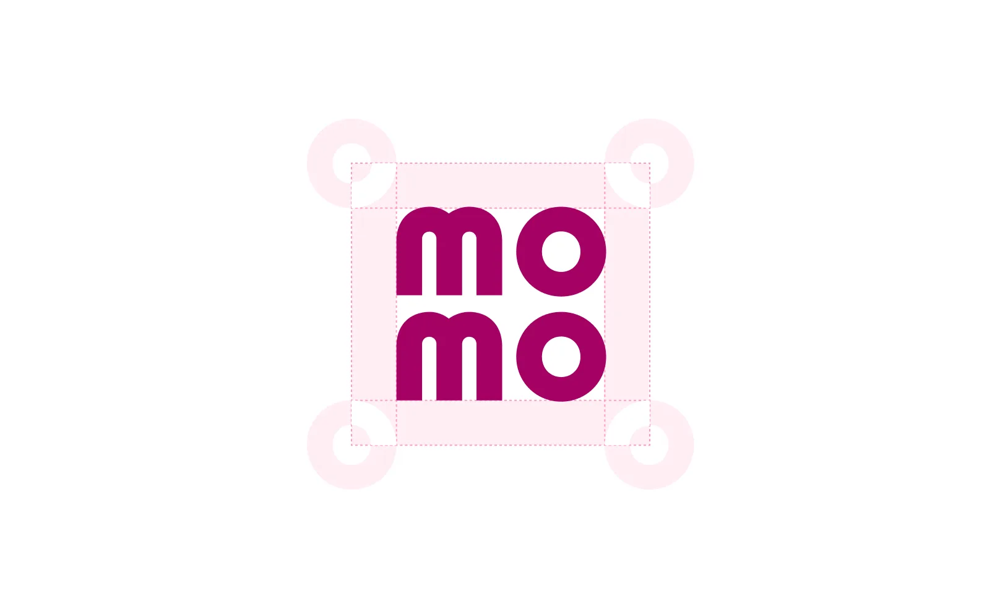
  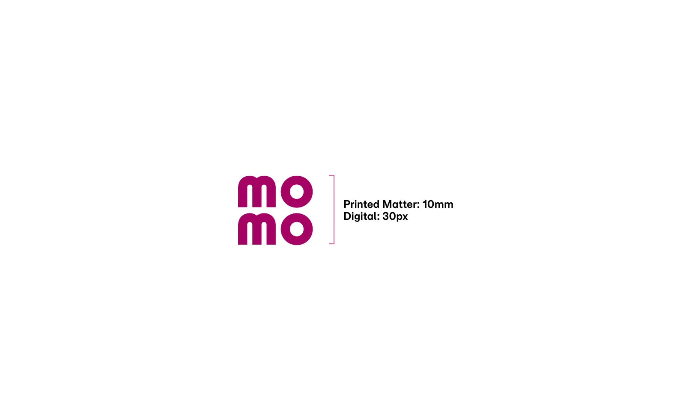
</p>

<p align="center">
  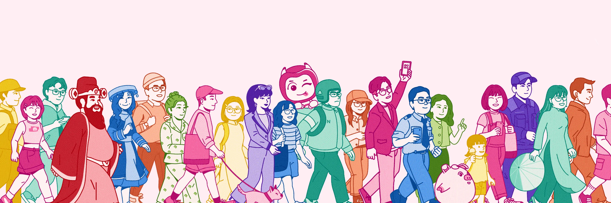
</p>

| Product surface | Example events | Primary consumer |
|-----------------|----------------|------------------|
| **Payments / Transfers** | `transfer_initiated`, `qr_scanned`, `payment_settled` | Risk, Finance, Product |
| **Ví Trả Sau (BNPL)** | `bnpl_offer_shown`, `installment_due`, `repayment_made` | Credit, Collections |
| **Vay Nhanh (Quick Loan)** | `loan_applied`, `score_requested`, `disbursed` | Credit scoring (DS) |
| **Túi Thần Tài (Invest)** | `fund_viewed`, `order_placed` | FS analytics |
| **MoMo Xu / Loyalty** | `reward_earned`, `voucher_redeemed` | Growth, Merchant |
| **Merchant / Offline (QR, EDC)** | `merchant_settle`, `device_txn` | Enterprise Payments |
| **AI Assistant** | `assistant_query`, `insight_clicked` | Personalization (DS) |

---

## 3. Solution design — the self-serve hybrid platform

### 3.1 As-is (pre-platform silos)

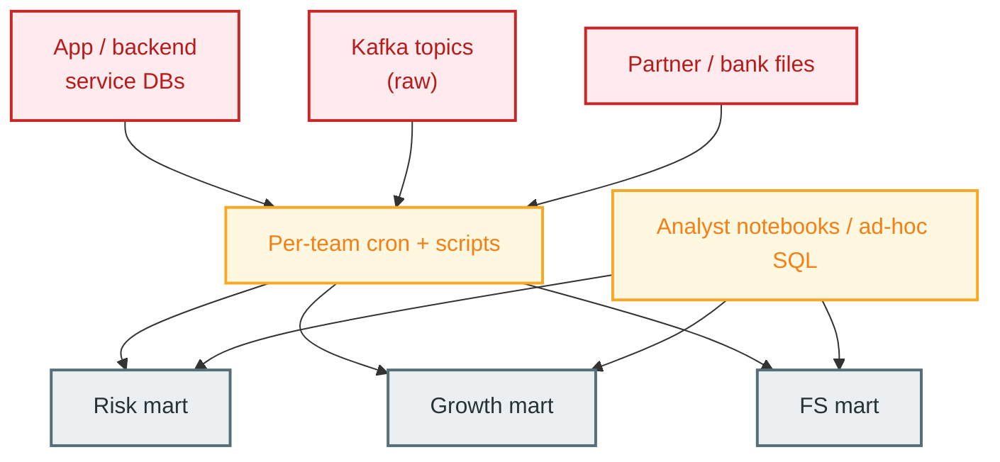

**Problems:** duplicated ingestion, no shared semantic layer, no DQ gates, no lineage, no cost attribution, no streaming for fraud.

Detail: [`docs/02-as-is-architecture.md`](docs/02-as-is-architecture.md)

### 3.2 To-be — self-serve hybrid lakehouse

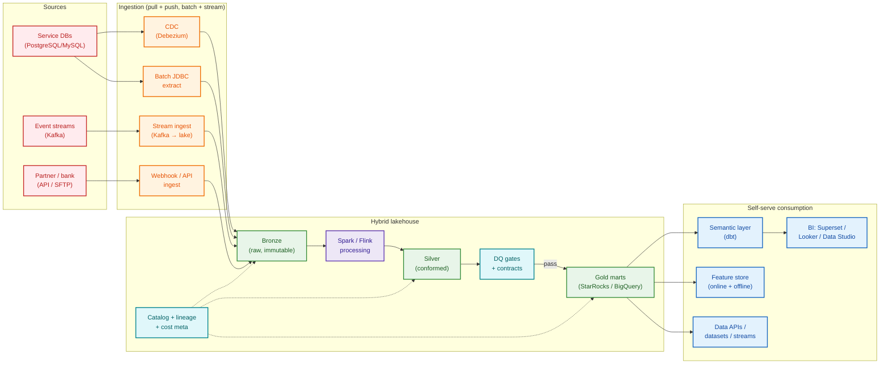

| Principle | Implementation |
|-----------|----------------|
| **Self-serve** | Semantic layer + governed gold marts; teams query without re-deriving |
| **Hybrid multi-cloud** | BigQuery + AWS + on-prem K8s; route by cost & data residency |
| **Medallion** | Bronze (raw) → Silver (conformed) → Gold (serving) |
| **Shift-left DQ** | Block gold publish on CRITICAL contract breach |
| **Lineage everywhere** | `pipeline_run_id` on every row; column-level catalog |
| **FinOps native** | Every job tagged to team/project; cost rolls up to org |
| **Streaming + batch** | Flink for real-time risk; Spark for batch marts |

Detail: [`docs/03-to-be-architecture.md`](docs/03-to-be-architecture.md)

### 3.3 Real-time fraud path (the latency-critical lane)

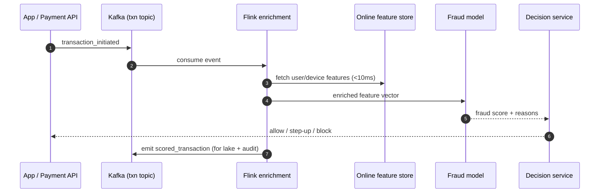

Case study: [`cases/01-realtime-fraud-detection.md`](cases/01-realtime-fraud-detection.md)

---

## 4. Data domains & modeling

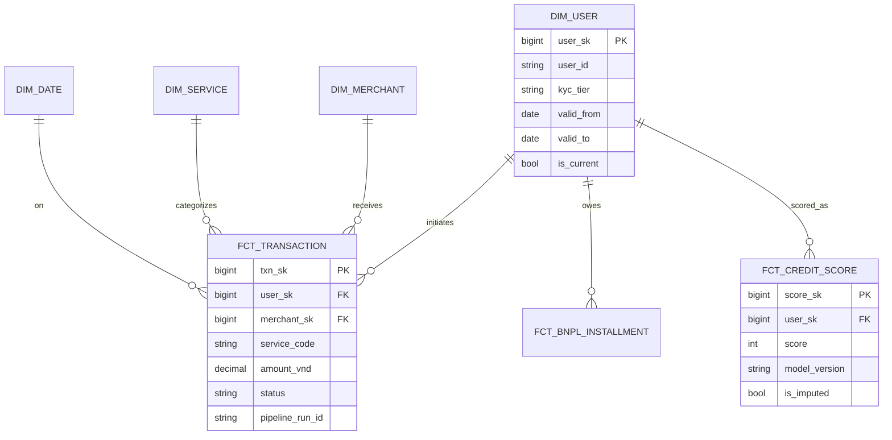

- **Dimensional modeling** (Kimball) for BI/self-serve marts; **Data Vault** patterns where source volatility is high.
- **SCD2** on `dim_user`, `dim_merchant` for point-in-time correctness (critical for credit decisions).
- **Declared vs estimated** attributes kept separate (`is_imputed`) — never silently overwrite, important for fintech audit.

Detail: [`docs/03-to-be-architecture.md`](docs/03-to-be-architecture.md) · modeling samples in [`samples/transform/`](samples/transform)

---

## 5. ML & AI data products

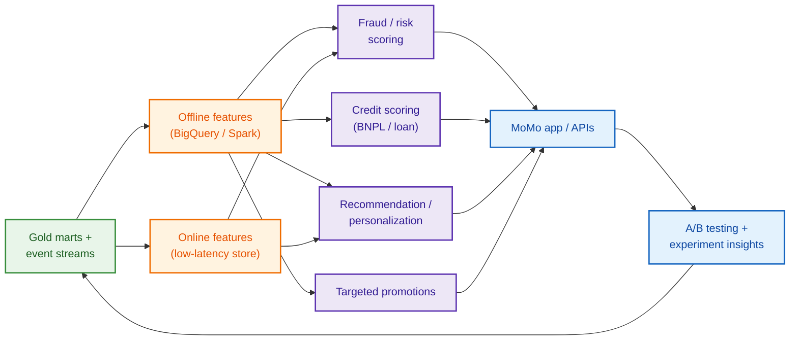

| Data product | Pattern | Sample |
|--------------|---------|--------|
| Real-time fraud | Streaming features + online scoring | [`samples/ml/feature_pipeline_fraud.py`](samples/ml/feature_pipeline_fraud.py) |
| Credit scoring (Ví Trả Sau) | Point-in-time features, explainable model | [`samples/ml/credit_scoring_train.py`](samples/ml/credit_scoring_train.py) |
| Personalization / reco | Behavioral features, A/B serving | [`docs/05-ml-data-products.md`](docs/05-ml-data-products.md) |

Detail: [`docs/05-ml-data-products.md`](docs/05-ml-data-products.md)

---

## 6. Engineering code samples

Runnable, dependency-light samples (most run with `DRY_RUN=1`, no cluster needed).

| Layer | Sample | What it shows |
|-------|--------|---------------|
| **Ingestion (CDC)** | [`samples/ingestion/cdc_debezium_to_lake.py`](samples/ingestion/cdc_debezium_to_lake.py) | Kafka CDC → bronze, idempotent upserts |
| **Ingestion (batch)** | [`samples/ingestion/batch_jdbc_ingest.py`](samples/ingestion/batch_jdbc_ingest.py) | Watermarked incremental JDBC pull |
| **Streaming** | [`samples/streaming/flink_txn_enrichment.py`](samples/streaming/flink_txn_enrichment.py) | PyFlink real-time enrichment + scoring |
| **Transform (Spark)** | [`samples/transform/spark_bronze_to_silver.py`](samples/transform/spark_bronze_to_silver.py) | Conform + quarantine bad records |
| **Transform (dbt)** | [`samples/transform/dim_user_scd2.sql`](samples/transform/dim_user_scd2.sql) | SCD2 user dimension |
| **Serving (StarRocks)** | [`samples/transform/gold_txn_daily_mart.sql`](samples/transform/gold_txn_daily_mart.sql) | Self-serve daily transaction mart |
| **Data quality** | [`samples/quality/dq_contract.py`](samples/quality/dq_contract.py) | Declarative DQ contract engine |
| **Data quality** | [`samples/quality/dq_freshness_checks.sql`](samples/quality/dq_freshness_checks.sql) | Freshness / completeness SQL checks |
| **Orchestration** | [`samples/orchestration/airflow_platform_dag.py`](samples/orchestration/airflow_platform_dag.py) | Dependency-aware platform DAG |
| **ML feature** | [`samples/ml/feature_pipeline_fraud.py`](samples/ml/feature_pipeline_fraud.py) | Online/offline feature parity |
| **ML training** | [`samples/ml/credit_scoring_train.py`](samples/ml/credit_scoring_train.py) | Credit model w/ explainability |

Quick run:

```bash
cd momo-vn-data-platform
pip install -r requirements.txt
DRY_RUN=1 python samples/quality/dq_contract.py
DRY_RUN=1 python samples/ingestion/batch_jdbc_ingest.py
```

Sample index & notes: [`samples/README.md`](samples/README.md)

---

## 7. Data governance, quality & FinOps

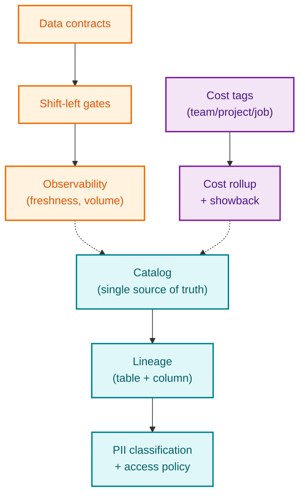

- **Data Management System**: govern the full data lifecycle, let consumers explore the ecosystem, provide a single source of truth.
- **Quality**: declarative contracts + shift-left gates so bad data never reaches gold/BI. See [`docs/06-data-quality-framework.md`](docs/06-data-quality-framework.md).
- **FinOps**: every pipeline tagged; cost attributed to teams/projects/departments. See [`docs/07-cost-finops.md`](docs/07-cost-finops.md).
- **Governance** detail: [`docs/04-data-governance-management.md`](docs/04-data-governance-management.md).

---

## 8. Team, org & role mapping

This platform maps directly to MoMo's published data roles. Full mapping: [`docs/08-team-org-roles.md`](docs/08-team-org-roles.md).

| Role (from public JDs) | Where it lives in this repo |
|------------------------|------------------------------|
| **Senior/Lead Data Engineering** | Ingestion, lakehouse, streaming, modeling, DQ, cost — `docs/03`, `samples/` |
| **Analytics Engineering Manager** | Semantic layer, dbt, BigQuery, Airflow/n8n, Looker — `docs/04`, `samples/transform` |
| **Senior Data Analyst (CDO)** | Self-serve marts, dashboards, segmentation, A/B — `docs/05`, `docs/08` |
| **Data Scientist (Risk/Fraud)** | Real-time fraud, credit scoring — `cases/01`, `samples/ml` |
| **Head of Data Science** | ML data-product strategy — `docs/05` |
| **Manager – Data (FS Division)** | FS analytics lifecycle, governance — `docs/04`, `docs/08` |

---

## 9. Repo map

```
momo-vn-data-platform/
├── README.md                          ← you are here (business → solution → engineering)
├── requirements.txt
├── .gitignore
├── docs/
│   ├── 01-business-context.md
│   ├── 02-as-is-architecture.md
│   ├── 03-to-be-architecture.md
│   ├── 04-data-governance-management.md
│   ├── 05-ml-data-products.md
│   ├── 06-data-quality-framework.md
│   ├── 07-cost-finops.md
│   ├── 08-team-org-roles.md
│   └── assets/product/                ← MoMo brand/product images (educational)
├── samples/
│   ├── ingestion/                     ← CDC + batch JDBC
│   ├── streaming/                     ← PyFlink enrichment
│   ├── transform/                     ← Spark + dbt + StarRocks
│   ├── quality/                       ← DQ contracts + checks
│   ├── orchestration/                 ← Airflow DAG
│   └── ml/                            ← fraud features + credit scoring
└── cases/
    ├── 01-realtime-fraud-detection.md
    └── 02-credit-scoring-vi-tra-sau.md
```

---

## Author & license

**Will Tran** — data engineering & analytics, fintech / e-wallet platforms.

**License:** MIT (educational use). All MoMo names, logos, and brand/product imagery are property of **M_Service (MoMo)** and are used here solely for non-commercial, illustrative portfolio purposes. This repository contains no confidential or proprietary MoMo information.
