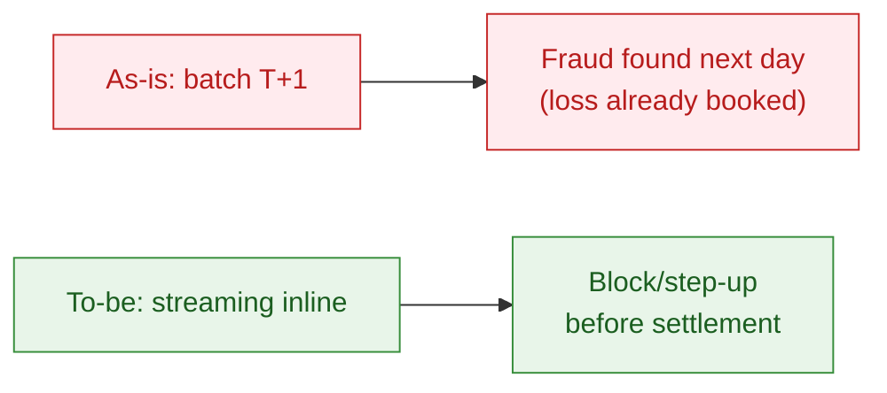
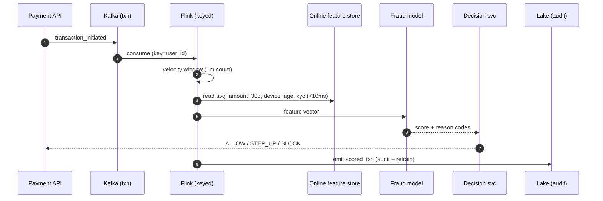
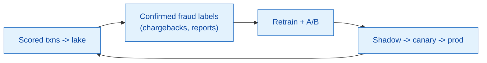

# Case study 01 — Real-time fraud detection lane

> How the platform stops fraud **before settlement** instead of reporting it the next day.
> Composite, educational scenario.

---

## 1. Problem

Batch-only scoring (T+1) means fraud is discovered *after* money has moved — the
business eats the loss and the user loses trust. For an e-wallet doing **1–2M+
risk checks/day**, the decision must happen **inline**, within the payment
latency budget (target end-to-end < 100 ms).



---

## 2. Architecture



Implementation: [`samples/streaming/flink_txn_enrichment.py`](../samples/streaming/flink_txn_enrichment.py)
· features [`samples/ml/feature_pipeline_fraud.py`](../samples/ml/feature_pipeline_fraud.py)

---

## 3. Features used (illustrative)

| Feature | Source | Path |
|---------|--------|------|
| `amount_to_avg_ratio` | online store (30d avg) | online + offline |
| `is_new_device` | device registry | online |
| `txn_count_1m` | Flink keyed window | streaming state |
| `low_kyc` | user dim | online |

All features come from **one definition** reused offline (training) and online
(serving) — parity is unit-tested so the model behaves the same in both.

---

## 4. Decision policy

| Score | Action | UX |
|-------|--------|----|
| `< 0.5` | ALLOW | seamless |
| `0.5–0.8` | STEP_UP | OTP / biometric challenge |
| `>= 0.8` | BLOCK | hold + manual review |

Every BLOCK/STEP_UP emits **reason codes** (e.g. `AMOUNT_5X_HISTORY`,
`HIGH_VELOCITY_1M`) so the action is auditable and explainable to risk & compliance.

---

## 5. Worked example (from the running sample)

```text
T2  U_002  900,000đ  -> score 0.9  BLOCK   [AMOUNT_5X_HISTORY, NEW_DEVICE, LOW_KYC]
T6  U_002  999,000đ  -> score 1.0  BLOCK   [..., HIGH_VELOCITY_1M, ...]
```

A new device (age ≤ 1 day) on a BASIC-KYC account spending ~10× its 30-day
average, six times in under a minute, is blocked inline.

---

## 6. Feedback loop



Scored transactions land in the lake; confirmed-fraud labels close the loop for
retraining. New models ship shadow → canary → full, monitored for score drift.

---

## 7. Role mapping

| Role | Contribution |
|------|--------------|
| Data Engineering | Kafka, Flink job, online store, lake audit sink |
| Data Science (Risk/Fraud) | Model, features, reason codes, A/B |
| Risk Analyst | Policy thresholds, false-positive review |
| Governance | Audit log retention, explainability sign-off |
