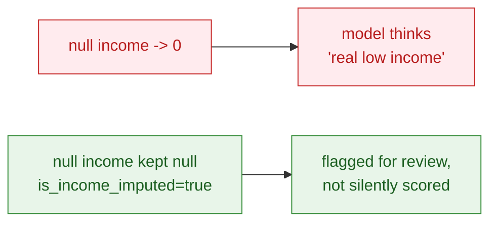
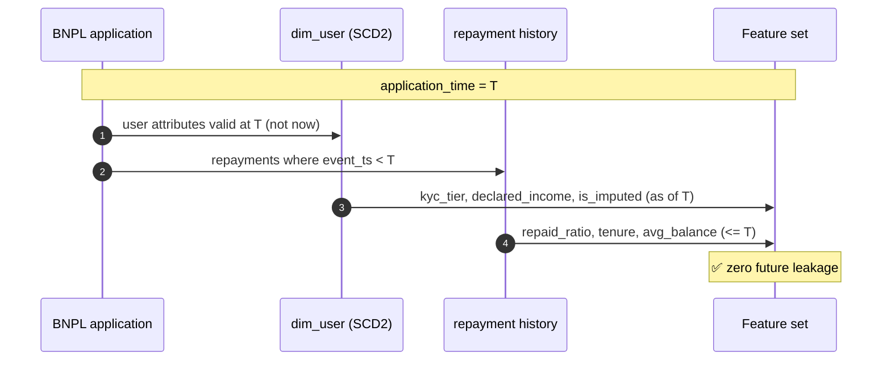

# Case study 02 — Credit scoring for Ví Trả Sau (BNPL)

> How the platform supports a regulated, explainable credit decision without
> leaking the future into the model. Composite, educational scenario.

---

## 1. Problem

**Ví Trả Sau** (Pay Later / BNPL) needs a fast, fair approval decision: should we
extend a credit line, and how much? Two data risks dominate:

1. **Leakage** — using information that wasn't known at application time inflates
   offline accuracy and collapses in production.
2. **Imputed attributes** — treating a missing declared income as `0` (or
   silently filling it) corrupts the model and is a compliance problem.



---

## 2. Point-in-time feature assembly



The SCD2 user dimension ([`dim_user_scd2.sql`](../samples/transform/dim_user_scd2.sql))
makes "the user as they were at T" a simple as-of join.

---

## 3. Features & model

| Feature | Meaning | Note |
|---------|---------|------|
| `tenure_months` | account age | thin-file risk |
| `repaid_ratio` | historical on-time repayment | strongest signal |
| `avg_balance_vnd` | wallet balance trend | liquidity proxy |
| `declared_income_vnd` | user-declared income | nullable |
| `is_income_imputed` | was income missing? | regulated flag |

Training + explainability: [`samples/ml/credit_scoring_train.py`](../samples/ml/credit_scoring_train.py)

---

## 4. Explainable decision

Every decision returns **reason codes** ranked by contribution:

```text
applicant: tenure 4m, repaid 0.45, balance 150k, income missing(imputed)
-> p_repay 0.0  DECLINE
   reasons: [tenure_months:-, declared_income_vnd:-, repaid_ratio:-]
   note: income imputed -> flagged for manual review per credit policy
```

Imputed income never silently drives an approval — it routes to manual review.

---

## 5. Governance & audit

| Control | Implementation |
|---------|----------------|
| Lineage | Every feature traces to source table + `pipeline_run_id` |
| Regulated attribute | `declared_income` + `is_income_imputed` kept separate |
| Reproducibility | `model_version` + feature snapshot stored |
| Auditability | Reason codes logged per decision |
| Fairness review | Periodic distribution checks by segment |

---

## 6. Lifecycle


---

## 7. Role mapping

| Role | Contribution |
|------|--------------|
| Data Engineering | SCD2 dims, feature tables, point-in-time joins |
| Data Science (FS) | Model, calibration, reason codes |
| Manager – Data (FS) | Governance, policy alignment, sign-off |
| Governance | Regulated-attribute lineage & audit |
