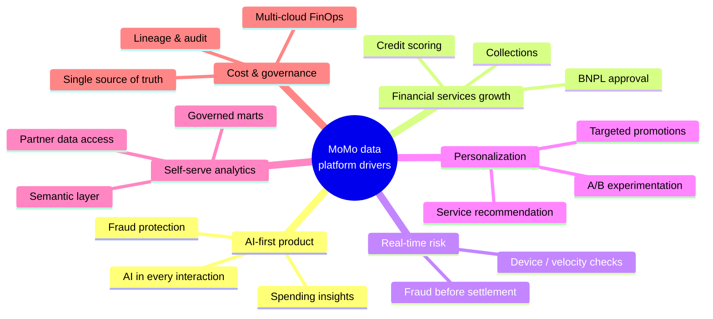
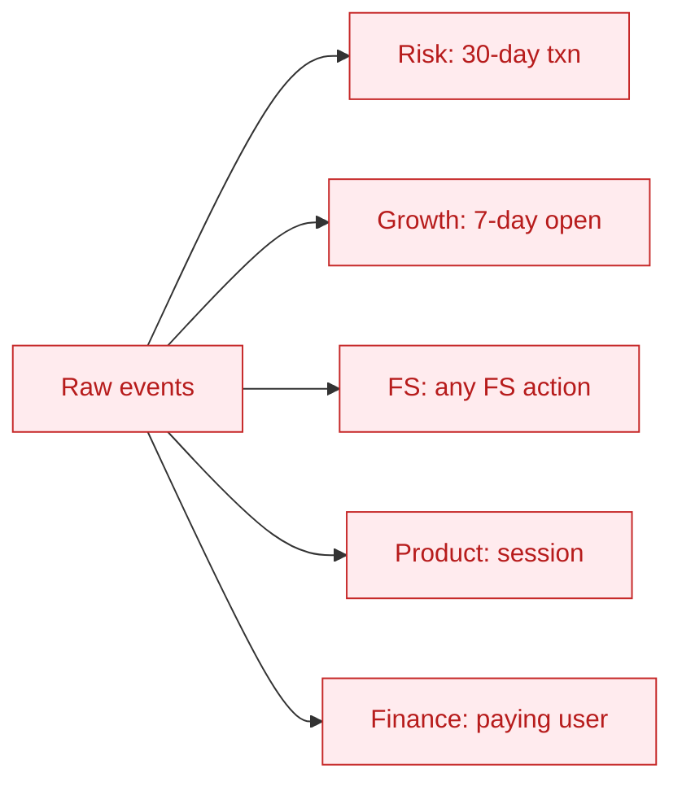
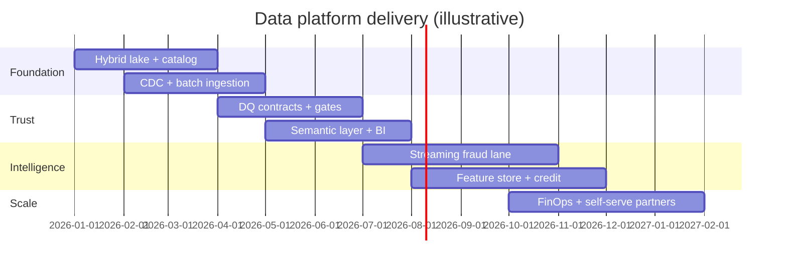

# 01 — Business context

> Composite, educational narrative for a fintech super-app shaped like **MoMo (M_Service)**.
> No confidential information; all figures are illustrative.

---

## 1. Who MoMo is (for data purposes)

MoMo positions itself as an **AI Financial Assistant** ("Trợ Thủ Tài Chính với AI"), not just an e-wallet. The product portfolio spans:

| Cluster | Services (public) |
|---------|-------------------|
| **Payments & transfers** | P2P transfer, QR pay, in-store payment, bill pay (electricity/water/internet) |
| **Financial services** | **Ví Trả Sau** (BNPL), **Vay Nhanh** (quick loan), credit card marketplace, insurance (**Bảo Hiểm Ô Tô/Xe Máy**), **Túi Thần Tài** (investment) |
| **Lifestyle** | Movie tickets, bus tickets, travel, gaming, e-commerce, mobile data top-up |
| **Merchant & loyalty** | Offline QR / EDC / wearable payments, **MoMo Xu** rewards & loyalty |
| **AI layer** | Spending management, personalized suggestions, fraud protection, financial insights |

Every cluster is a **data producer** and a **data consumer**. The platform's job is to make that loop trustworthy, fast, and self-serve.

---

## 2. Strategic drivers

---

## 3. As-is operating model & pain

| Function | As-is behavior | Pain |
|----------|----------------|------|
| **Risk / Fraud** | Overnight batch scoring | Fraud detected after money moves |
| **Credit (FS)** | Ad-hoc feature pulls per model | Point-in-time leakage risk; slow iteration |
| **Growth / Marketing** | CRM exports + spreadsheets | Stale segments; duplicate targeting |
| **Product analytics** | Notebooks on raw tables | Conflicting metric definitions |
| **Finance / FinOps** | Cloud bill arrives monthly | No attribution to team/job |
| **Partners / Merchants** | Manual data extracts | Slow, no self-serve |

### 3.1 The "five definitions of active user" problem

Five teams, five SQL definitions, five numbers in the same exec meeting. A **semantic layer** with one governed `metric: active_user` fixes this.

---

## 4. Target business outcomes

| KPI (illustrative) | Direction |
|--------------------|-----------|
| Time-to-insight for a new business question | Weeks → hours |
| Fraud caught pre-settlement | Up (streaming lane) |
| Credit model iteration cycle | Down (point-in-time feature store) |
| Metric trust (single definition adoption) | Up to near 100% across teams |
| Cloud cost attributed to an owner | ~100% of spend tagged |
| Self-serve datasets used without DE tickets | Up |

---

## 5. Engagement / delivery shape

---

## 6. Discovery questions

1. Who is **system-of-record** for each money-movement event — app, payment core, or ledger?
2. What is the hard **latency budget** for the fraud decision (e.g. < 100 ms end-to-end)?
3. Which attributes are **regulated** (credit, KYC) and require lineage + audit?
4. Data **residency** constraints across cloud providers?
5. What single number does the **President / CDO** want to move in 90 days?
