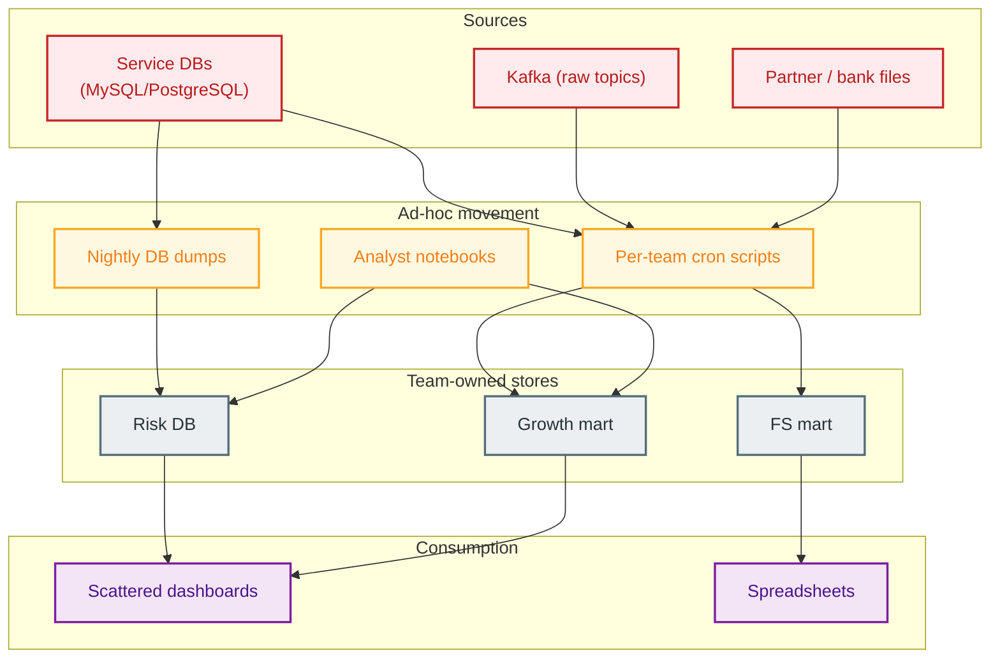
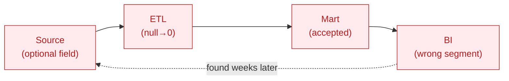

# 02 — As-is architecture (pre-platform)

> The state a fast-growing fintech typically reaches before investing in a real data platform.

---

## 1. As-is landscape



---

## 2. What breaks at scale

| Symptom | Root cause | Downstream damage |
|---------|------------|-------------------|
| Duplicate ingestion of the same source | No shared bronze layer | 3× cost, drift between copies |
| Conflicting metrics | No semantic layer | Distrust in dashboards |
| Late dashboards | Brittle cron, no SLA | Missed campaigns, blind risk |
| No fraud streaming | Batch-only | Fraud detected post-settlement |
| Bad data in BI | DQ checked *after* publish | Wrong exec decisions |
| Bill shock | No cost tags | No accountability |
| Point-in-time leakage | Features pulled "as of now" | Over-optimistic credit models |

---

## 3. Anti-pattern spotlight — `NULL → 0` on income

```sql
-- as-is: optional income field silently coerced
SELECT user_id,
       COALESCE(declared_income, 0) AS income   -- ❌ pollutes credit features
FROM   raw_kyc;
```

A user who didn't declare income becomes a "0 income" user — which then feeds the credit model as if it were a real low-income signal. The to-be design keeps `declared_income` nullable and tracks `is_imputed` separately.

---

## 4. As-is data flow (the late-DQ trap)



No gate exists between source and mart, so quality issues surface only when a human notices a weird dashboard — often weeks later.

---

## 5. Why "just add more cron" fails

- Each new source multiplies maintenance, not capability.
- No lineage → every incident is a manual archaeology dig.
- No contracts → every schema change silently breaks downstream.
- No cost attribution → optimization has no owner.

This motivates the [to-be platform](03-to-be-architecture.md).
