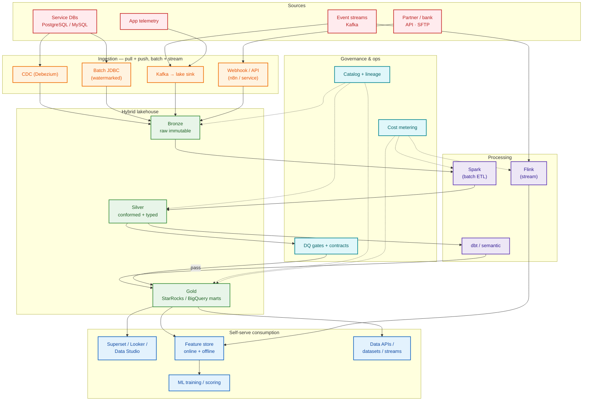
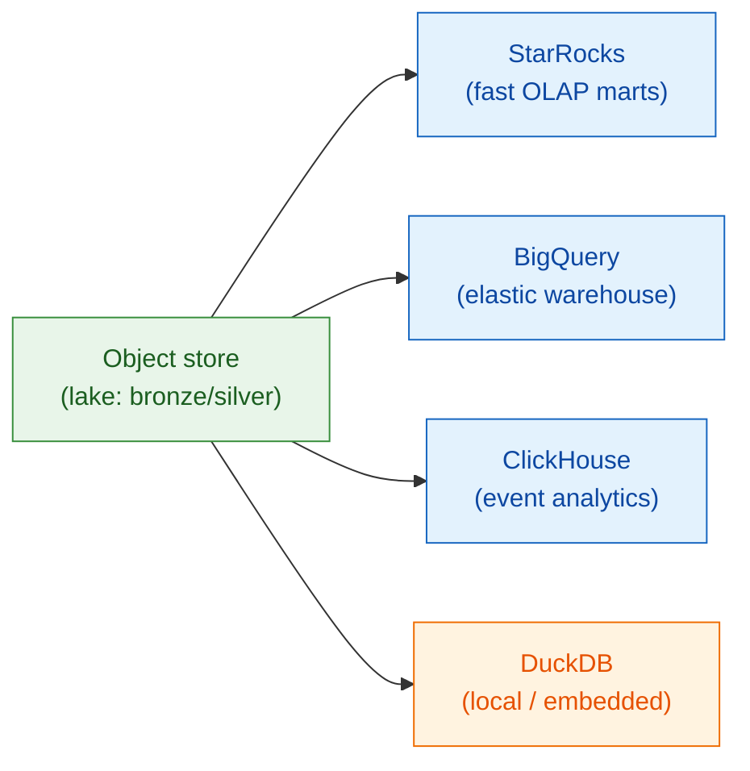
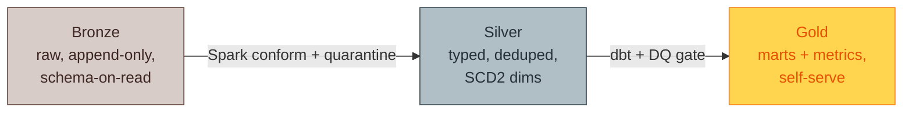
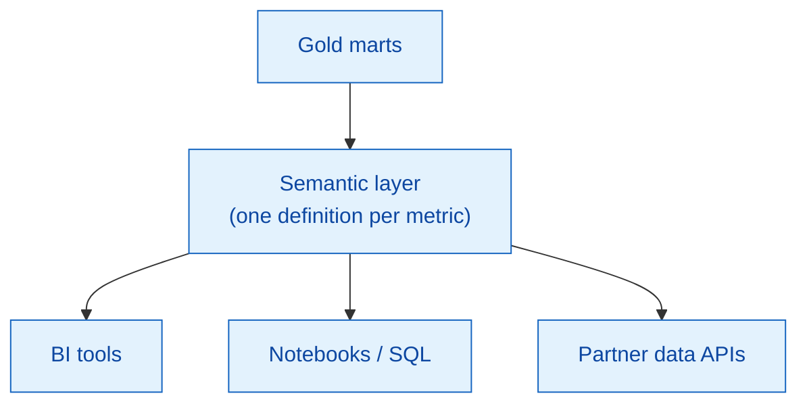

# 03 — To-be architecture: self-serve hybrid data platform

> A next-generation, multi-cloud, self-serve platform aligned to MoMo's published Data Platform mission.

---

## 1. Design principles

| # | Principle | Why it matters at MoMo |
|---|-----------|------------------------|
| 1 | **Self-serve first** | Business/Product/partners answer their own questions via governed marts + semantic layer |
| 2 | **Hybrid multi-cloud** | BigQuery + AWS + on-prem K8s; route by cost, latency, residency |
| 3 | **Medallion lakehouse** | Bronze → Silver → Gold, immutable raw, conformed core, serving marts |
| 4 | **Stream + batch** | Flink for real-time risk; Spark for batch marts; one logical model |
| 5 | **Shift-left quality** | Contracts + gates; bad data never reaches gold |
| 6 | **Lineage everywhere** | `pipeline_run_id` per row; column-level catalog |
| 7 | **FinOps native** | Every job tagged → cost rolls up to team/project/department |
| 8 | **Data as a product** | Datasets owned, documented, SLA'd like software |

---

## 2. Full platform architecture

---

## 3. Ingestion matrix

| Source type | Mechanism | Mode | Tool | Sample |
|-------------|-----------|------|------|--------|
| OLTP service DBs | CDC | Stream (push) | Debezium → Kafka | [`cdc_debezium_to_lake.py`](../samples/ingestion/cdc_debezium_to_lake.py) |
| Reference / dimension tables | JDBC | Batch (pull) | Spark JDBC | [`batch_jdbc_ingest.py`](../samples/ingestion/batch_jdbc_ingest.py) |
| Product events | Topic sink | Stream | Kafka Connect / Flink | [`flink_txn_enrichment.py`](../samples/streaming/flink_txn_enrichment.py) |
| Partner / bank | API / SFTP | Batch + webhook | n8n / service | `docs/04` |

---

## 4. Storage & engine choices

| Engine | Sweet spot |
|--------|-----------|
| **Object store + Spark** | Cheap, immutable bronze/silver; heavy batch transforms |
| **StarRocks** | Sub-second self-serve marts, high-concurrency BI |
| **BigQuery** | Elastic, serverless warehouse; ML-adjacent SQL |
| **ClickHouse** | High-cardinality event/funnel analytics |
| **DuckDB** | Local dev, unit tests, lightweight extracts |

---

## 5. Medallion contract

| Layer | Guarantees | Owner |
|-------|------------|-------|
| Bronze | Exactly what arrived, immutable, lineage stamped | Data Engineering |
| Silver | Conformed types, dedup, SCD2, PII tagged | Data Engineering |
| Gold | Business metrics, documented, SLA'd | Analytics Engineering |

---

## 6. Self-serve & semantic layer

One governed definition of `active_user`, `gmv`, `npl_rate` consumed identically by every tool — killing the "five definitions" problem from [`01-business-context.md`](01-business-context.md).

---

## 7. As-is → to-be summary

| Dimension | As-is | To-be |
|-----------|-------|-------|
| Ingestion | Per-team cron | Shared CDC + batch + stream |
| Storage | Team marts | Medallion lakehouse |
| Quality | After BI | Shift-left contracts + gates |
| Metrics | 5 definitions | 1 semantic layer |
| Fraud | Batch T+1 | Real-time Flink lane |
| Cost | Monthly surprise | Per-job FinOps tags |
| Lineage | Tribal knowledge | Column-level catalog |
| Access | DE tickets | Self-serve marts + APIs |
