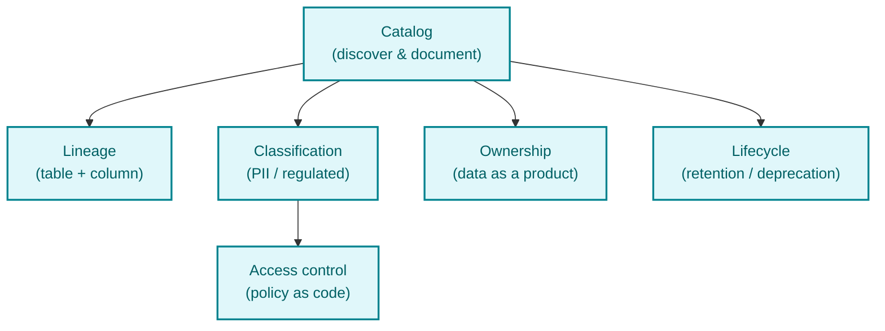
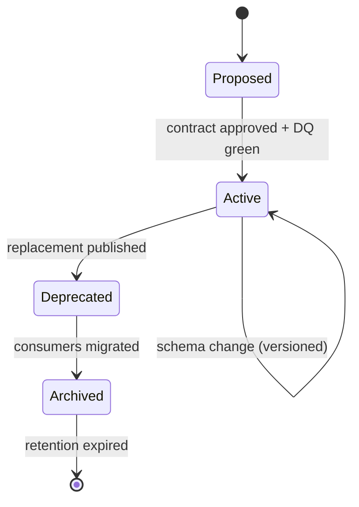
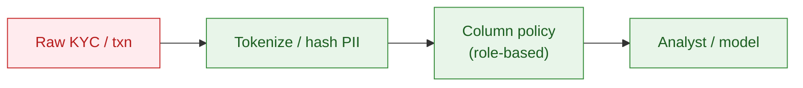
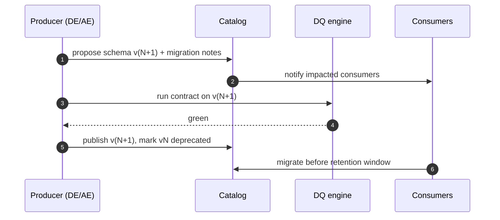

# 04 — Data governance & data management system

> Aligned to MoMo's stated goal of a **Data Management System** that lets the governance team
> and consumers manage the full data lifecycle, explore the ecosystem, and trust a single source of truth.

---

## 1. Governance pillars



---

## 2. Data lifecycle



Each dataset moves through a governed lifecycle. Consumers always know whether a dataset is **Active**, **Deprecated**, or **Archived** — no silent breakage.

---

## 3. Catalog entry (data-as-a-product contract)

Every gold dataset ships a contract like this:

```yaml
dataset: gold.fct_transaction_daily
owner: analytics-engineering
domain: payments
sla:
  freshness: "06:00 ICT daily"
  availability: 99.5%
schema_version: 3
pii: false
grain: "user_sk x service_code x date"
metrics:
  - gmv_vnd
  - txn_count
  - active_users
quality_contract: contracts/fct_transaction_daily.yml
lineage_upstream:
  - silver.transaction
  - silver.dim_user
consumers:
  - bi.superset.exec_overview
  - ml.fraud.offline_features
cost_tag: { team: payments-analytics, project: self-serve-marts }
```

---

## 4. PII & regulated-attribute handling



| Class | Examples | Rule |
|-------|----------|------|
| **PII** | phone, national ID, name | Tokenized in silver; raw access logged & restricted |
| **Regulated** | credit score, income | Lineage mandatory; `is_imputed` tracked; audit export |
| **Behavioral** | clicks, sessions | Aggregated for personalization |
| **Public** | service catalog | Open self-serve |

---

## 5. Roles in governance (RACI)

| Activity | Data Eng | Analytics Eng | Data Governance | Business owner |
|----------|:--------:|:-------------:|:---------------:|:--------------:|
| Define metric | C | A | C | R |
| Build pipeline | A | C | I | I |
| Approve contract | C | C | A | R |
| Classify PII | C | I | A | C |
| Grant access | C | I | A | R |
| Deprecate dataset | A | R | C | C |

A = Accountable · R = Responsible · C = Consulted · I = Informed

---

## 6. Change control


