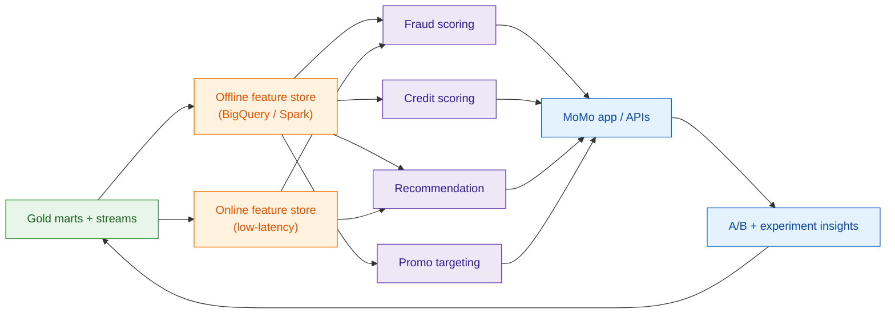
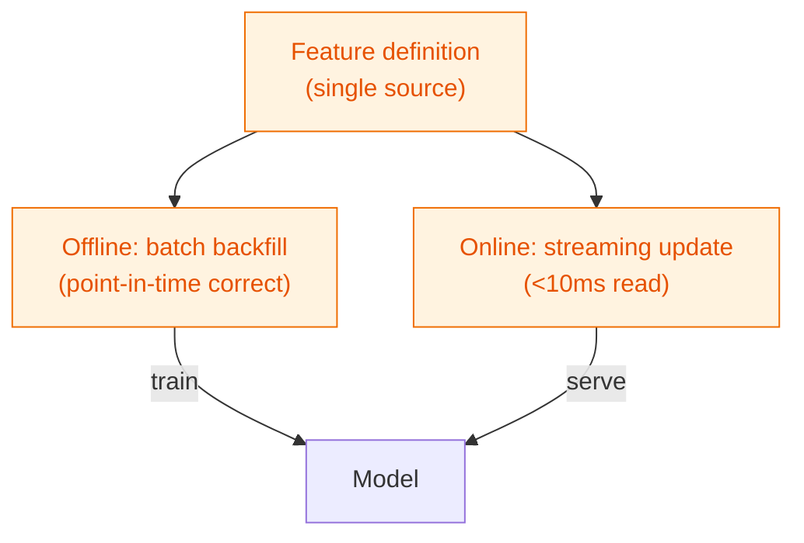
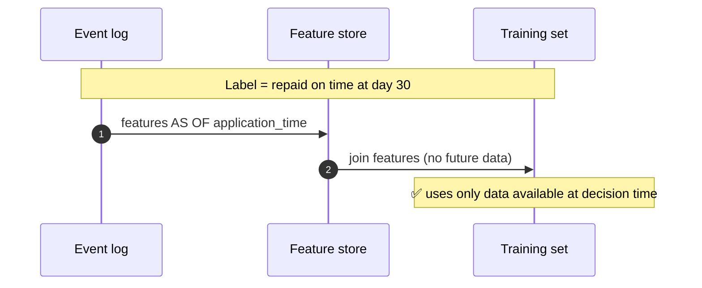
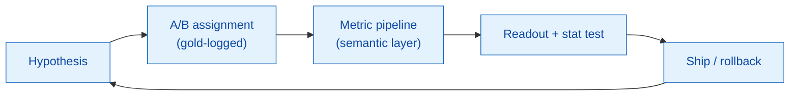

# 05 — ML & AI data products

> How the platform feeds MoMo's ML products: recommendation, personalization, risk/fraud,
> credit scoring, targeted promotions, and financial services.

---

## 1. From data platform to ML products

---

## 2. Online / offline feature parity

The #1 cause of "great offline, bad online" models is **training/serving skew**. The platform enforces a single feature definition used in both paths.

See [`samples/ml/feature_pipeline_fraud.py`](../samples/ml/feature_pipeline_fraud.py).

---

## 3. ML data-product catalog

| Product | Decision | Latency | Key features | Governance note |
|---------|----------|---------|--------------|-----------------|
| **Real-time fraud** | allow / step-up / block | < 100 ms | velocity, device, amount-vs-history | Audit every block reason |
| **Credit scoring (Ví Trả Sau)** | approve / limit | seconds | repayment history, tenure, income (declared) | Explainable; `is_imputed` tracked |
| **Quick loan (Vay Nhanh)** | approve / price | seconds | same + behavioral | Regulated; lineage required |
| **Recommendation** | which service next | < 200 ms | recent activity, segment | A/B gated |
| **Promo targeting (MoMo Xu)** | who/what/when | minutes | propensity, budget cap | Budget guardrails |

---

## 4. Point-in-time correctness (no leakage)

A credit model must only see what was knowable **at application time**. The platform's SCD2 dims + as-of joins guarantee this. See [`samples/ml/credit_scoring_train.py`](../samples/ml/credit_scoring_train.py).

---

## 5. Experimentation loop

Assignment and exposure events flow into gold, so every experiment uses the **same governed metrics** as the rest of the business — no bespoke math per test.

---

## 6. MLOps guardrails

| Concern | Platform control |
|---------|------------------|
| Training/serving skew | Shared feature definitions, parity tests |
| Data leakage | As-of joins on SCD2 dims |
| Model drift | Monitor feature & score distributions |
| Reproducibility | `model_version` + feature snapshot lineage |
| Fairness / audit | Reason codes logged for credit & fraud decisions |
