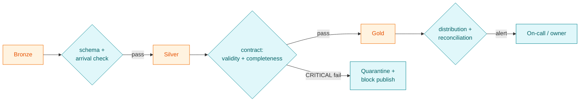
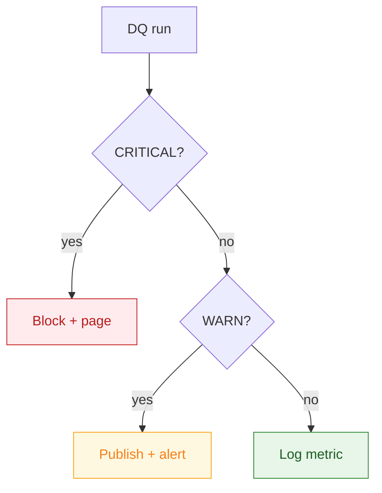

# 06 — Data quality framework (shift-left)

> Quality is enforced **before** data reaches gold/BI/ML — not discovered afterward by a confused analyst.

---

## 1. Quality dimensions

| Dimension | Question | Example check |
|-----------|----------|---------------|
| **Freshness** | Is it on time? | `max(event_ts) > now - 2h` |
| **Completeness** | Are required fields present? | `null_rate(user_id) = 0` |
| **Validity** | Are values in range? | `amount_vnd >= 0` |
| **Uniqueness** | Any dup grain? | `count = count(distinct pk)` |
| **Consistency** | Cross-source agreement? | `gold.gmv ≈ ledger.gmv (±0.1%)` |
| **Distribution** | Did the shape shift? | `null_rate(income)` within band |

---

## 2. Where checks run (shift-left)



---

## 3. Severity & action

| Severity | Meaning | Action |
|----------|---------|--------|
| **CRITICAL** | Wrong/missing data that would mislead | **Block** gold publish; page owner |
| **WARN** | Suspicious but not blocking | Publish + alert; track trend |
| **INFO** | Observability signal | Log to catalog metrics |



---

## 4. Declarative contract (sample)

```yaml
# contracts/fct_transaction_daily.yml
dataset: gold.fct_transaction_daily
checks:
  - name: freshness
    severity: CRITICAL
    rule: "max(load_ts) >= now() - interval '2 hours'"
  - name: pk_unique
    severity: CRITICAL
    rule: "count(*) == count(distinct user_sk, service_code, dt)"
  - name: amount_non_negative
    severity: CRITICAL
    rule: "min(gmv_vnd) >= 0"
  - name: income_null_rate
    severity: WARN
    rule: "null_rate(declared_income) between 0.0 and 0.6"
```

The engine that runs these: [`samples/quality/dq_contract.py`](../samples/quality/dq_contract.py).
SQL freshness/completeness checks: [`samples/quality/dq_freshness_checks.sql`](../samples/quality/dq_freshness_checks.sql).

---

## 5. Incident flow (CRITICAL breach in prod)

```mermaid
sequenceDiagram
    autonumber
    participant DQ as DQ engine
    participant DE as Data Engineer
    participant AE as Analytics Eng
    participant BIZ as Business owner
    participant SRC as Source team

    DQ->>DE: CRITICAL — income_null_rate 0.95 (band ≤0.6)
    DE->>DE: reconcile source vs bronze vs silver
    DE->>SRC: KYC form made income optional in release X
    DE->>AE: hold gold publish; keep last good partition
    AE->>BIZ: dashboards frozen at T-1, ETA for fix
    SRC->>SRC: restore required field / backfill
    DE->>DQ: re-run contract → green
    AE->>BIZ: gold republished, dashboards live
```

---

## 6. Observability dashboard (what governance watches)

| Panel | Signal |
|-------|--------|
| Freshness heatmap | Datasets late vs SLA |
| Contract pass rate | % runs green per domain |
| Quarantine volume | Rows rejected per pipeline |
| Distribution drift | Null-rate / value bands over time |
| Open incidents | CRITICAL breaches & MTTR |
