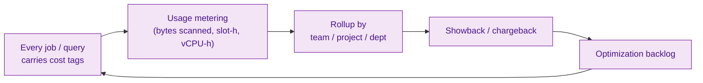
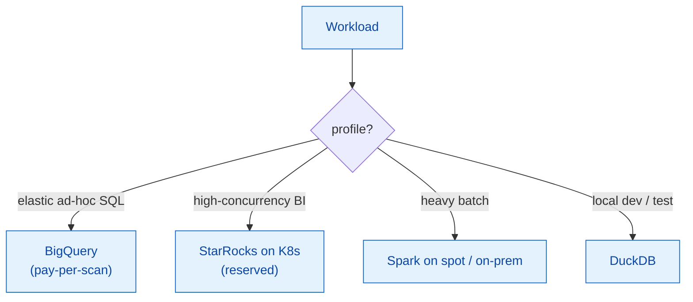
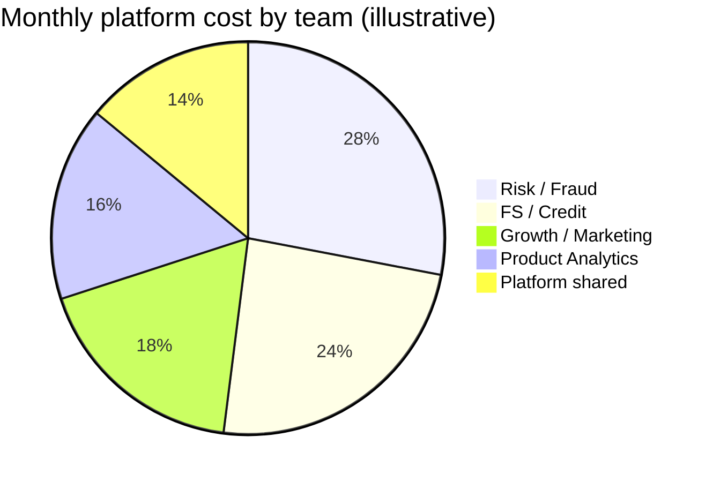

# 07 — Cost & FinOps

> MoMo is building a hybrid multi-cloud platform "giving greater control over both cost and technology."
> This is how the platform tracks and optimizes spend across projects, teams, and departments.

---

## 1. FinOps principle: every byte and CPU has an owner



---

## 2. Cost tag standard

```yaml
cost_tag:
  team: payments-analytics
  project: self-serve-marts
  department: corporate-data-office
  environment: prod
  data_product: gold.fct_transaction_daily
```

Tags are injected by the orchestration layer ([`airflow_platform_dag.py`](../samples/orchestration/airflow_platform_dag.py)) and on every BigQuery/StarRocks query label.

---

## 3. Multi-cloud routing for cost



| Workload | Cheapest fit | Why |
|----------|--------------|-----|
| Spiky ad-hoc SQL | BigQuery on-demand | No idle cluster |
| Steady BI concurrency | StarRocks reserved | Predictable, fast |
| Nightly heavy ETL | Spark on spot/on-prem | Throughput per VND |
| Dev / CI | DuckDB local | Zero cloud cost |

---

## 4. Cost optimization levers

| Lever | Mechanism | Typical saving |
|-------|-----------|----------------|
| Partition & prune | Date/service partitioning | Less bytes scanned |
| Materialize hot marts | Pre-aggregate in StarRocks | Fewer repeated scans |
| Spot / preemptible | Batch on interruptible VMs | Lower compute rate |
| Storage tiering | Cold bronze → archive class | Lower storage VND |
| Kill zombie jobs | Catalog flags unused datasets | Stop paying for nothing |
| Query guardrails | Max-bytes-billed per role | Prevents runaway scans |

---

## 5. Showback report (illustrative)



| Team | Driver | Action |
|------|--------|--------|
| Risk / Fraud | Streaming + online store | Right-size Flink parallelism |
| FS / Credit | Large training scans | Snapshot feature tables |
| Growth | Frequent dashboard refresh | Cache + scheduled refresh |
| Product | Ad-hoc exploration | Query guardrails + DuckDB extracts |

---

## 6. FinOps + governance link

Cost metadata lives in the **same catalog** as lineage and quality. So "this dataset costs X/month, is consumed by Y, last queried Z" is a single lookup — enabling confident deprecation of expensive, unused data.
