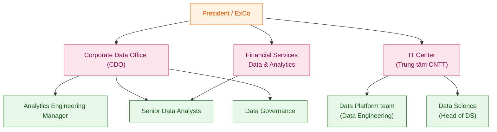
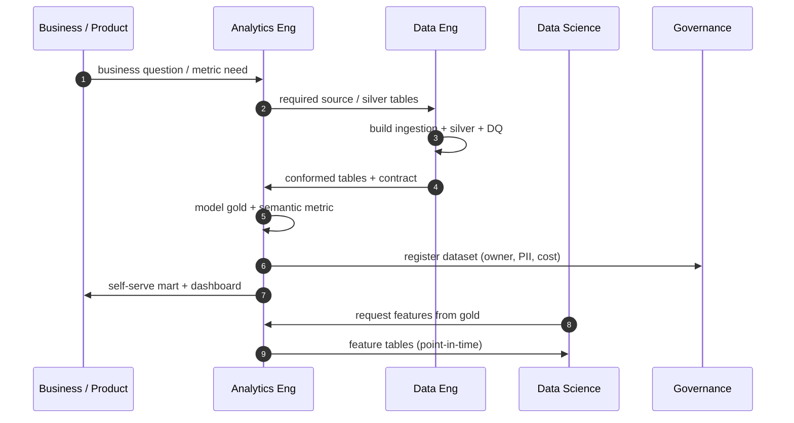

# 08 — Team, org & role mapping

> How the platform maps to MoMo's real, publicly-posted data organization and roles.
> Role descriptions are paraphrased from public job descriptions and public profiles.

---

## 1. Org shape (data function)



---

## 2. Role ↔ platform component matrix

| Role (public JD / profile) | Owns | This repo |
|----------------------------|------|-----------|
| **Senior/Lead Data Engineering** (ITC, Data Platform) | Ingestion, lakehouse, Spark/Flink, StarRocks/ClickHouse, modeling, DQ, cost | [`03`](03-to-be-architecture.md), [`samples/ingestion`](../samples/ingestion), [`samples/streaming`](../samples/streaming) |
| **Analytics Engineering Manager** (CDO) | Semantic layer, dbt, BigQuery, Airflow/n8n, Looker, standards & CI/CD | [`04`](04-data-governance-management.md), [`samples/transform`](../samples/transform), [`samples/orchestration`](../samples/orchestration) |
| **Senior Data Analyst** (CDO) | Self-serve dashboards, segmentation, funnel/cohort, A/B | [`05`](05-ml-data-products.md), [`06`](06-data-quality-framework.md) |
| **Data Scientist – Risk/Fraud** (ITC) | Fraud & credit models, A/B, productionization | [`cases/01`](../cases/01-realtime-fraud-detection.md), [`samples/ml`](../samples/ml) |
| **Head of Data Science** | ML data-product strategy, personalization, FS | [`05`](05-ml-data-products.md) |
| **Manager – Data** (FS Division) | FS analytics lifecycle, governance, mentoring | [`04`](04-data-governance-management.md) |
| **Data Analyst – Risk Dept** | Fraud/ops risk analysis, promo cost optimization | [`cases/01`](../cases/01-realtime-fraud-detection.md), [`07`](07-cost-finops.md) |
| **Director – Enterprise Offline Payment** | QR/EDC/wearable + MoMo Xu loyalty data needs | [`01`](01-business-context.md) §1, merchant domain |

---

## 3. Collaboration model (data as a product)



---

## 4. Skills emphasized across MoMo data JDs (and where they show up)

| Skill cluster | Repo evidence |
|---------------|---------------|
| SQL / Python / JVM | `samples/` across the board |
| Spark / Flink / StarRocks | `samples/transform`, `samples/streaming` |
| BigQuery / dbt / semantic layer | `samples/transform`, `docs/03`, `docs/04` |
| Airflow / n8n orchestration | `samples/orchestration` |
| Data Vault / dimensional modeling | `docs/03`, `samples/transform/dim_user_scd2.sql` |
| Data quality / governance / lineage | `docs/04`, `docs/06`, `samples/quality` |
| Kubernetes / hybrid multi-cloud | `docs/03`, `docs/07` |
| Credit scoring / fraud / personalization | `docs/05`, `cases/`, `samples/ml` |
| Cost tracking / FinOps | `docs/07` |

---

## 5. 90-second platform pitch (English)

```text
MoMo is shifting from an e-wallet to an AI Financial Assistant, and that only works
if every team trusts the same data, in real time, at a cost we can see.

This platform is a hybrid multi-cloud lakehouse: CDC and batch and streaming
ingestion into a medallion lake, conformed in Spark, served as governed gold marts
through a semantic layer — so Business, Risk, Credit, and Growth all use one
definition of every metric.

The fraud lane is real-time on Flink with an online feature store, scoring
transactions before settlement. Credit scoring for Ví Trả Sau runs on point-in-time
features so we never leak the future into the model.

Quality is shifted left with contracts that block bad data from reaching gold, and
every job is cost-tagged so we attribute spend to a team and optimize it. That is the
exact shape of MoMo's Data Platform mission: self-serve, governed, hybrid, and AI-first.
```
