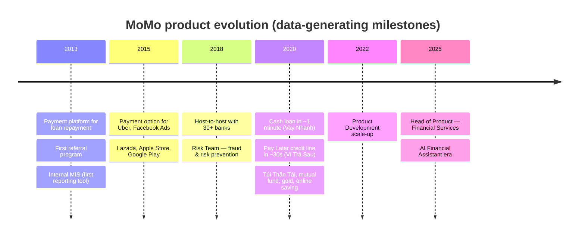
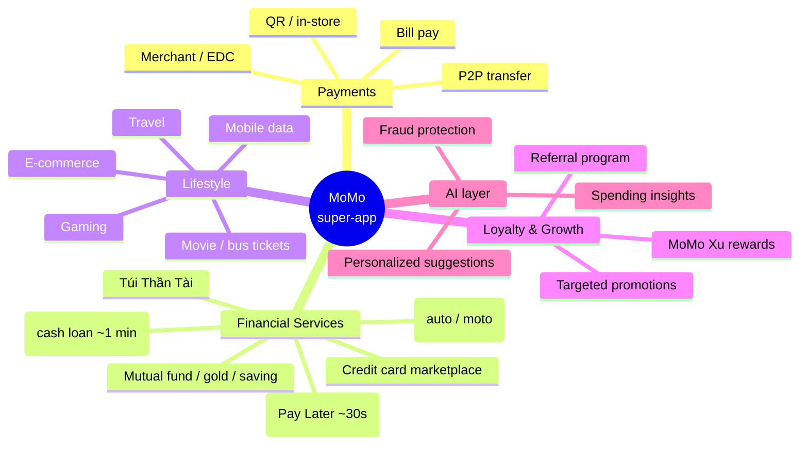
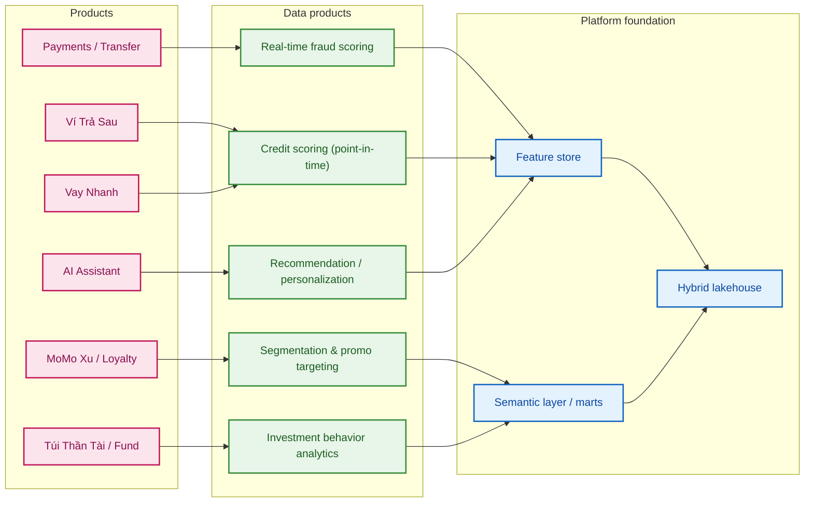
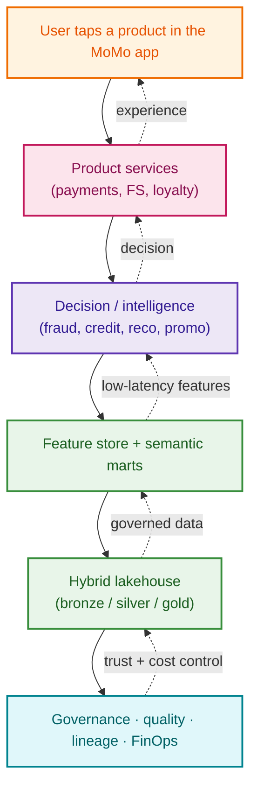
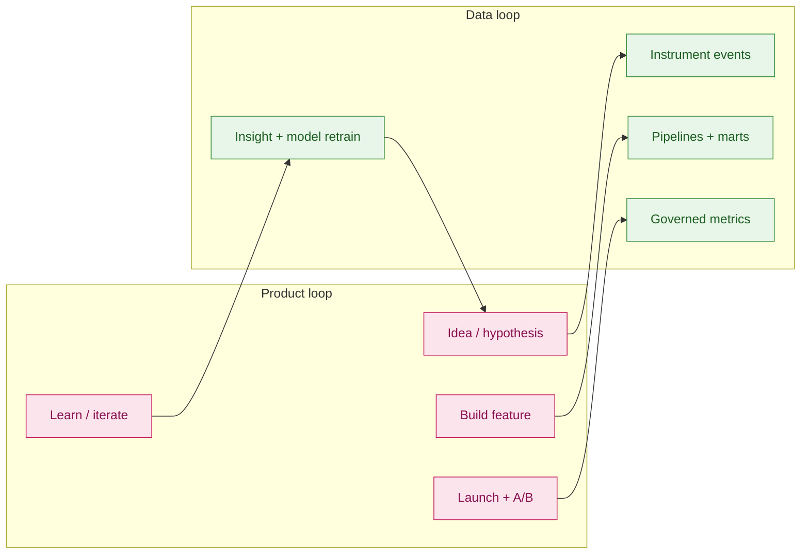
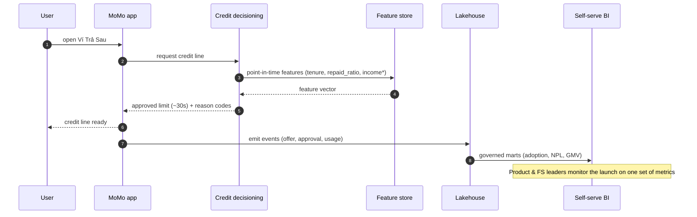
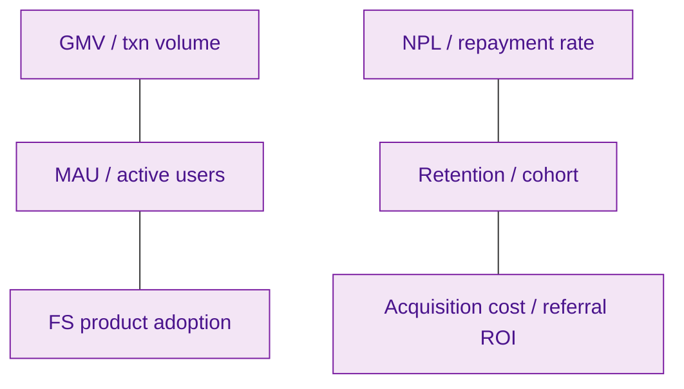

# 09 — Product portfolio & the data platform beneath it

> A visual map of MoMo's product surface and the data platform that powers each product.
> Product evolution is paraphrased from public information and a public **Head of Product –
> Financial Services** profile (13+ years across Product Owner → Head of Product). Educational use only.

---

## 1. Product evolution timeline

A decade of product, each wave generating new data needs the platform must serve.

> **Data reading of this timeline:** the platform's requirements grew from *batch
> reporting (MIS, 2013)* → *integration analytics (2015)* → *real-time risk (2018)*
> → *credit scoring & investment data (2020)* → *AI-first self-serve (2025)*. Each
> wave maps onto a layer in [`docs/03-to-be-architecture.md`](03-to-be-architecture.md).

---

## 2. Product portfolio (super-app surface)

---

## 3. Product → data product map

Every product line is backed by a data product on the platform.

---

## 4. The data platform "under" the product (layered view)

Read top-down: a tap becomes a product action, which calls an intelligence layer,
fed by features and marts, materialized from the lakehouse, all governed and cost-tracked.

---

## 5. Product lifecycle ↔ data lifecycle

How a Product Manager's launch loop is mirrored by the platform.

---

## 6. Example: a Pay Later (Ví Trả Sau) journey end-to-end

`*income` follows the declared-vs-imputed rule — see
[`cases/02-credit-scoring-vi-tra-sau.md`](../cases/02-credit-scoring-vi-tra-sau.md).

---

## 7. Product KPIs the platform serves (illustrative)

| Product area | Primary KPI | Served by |
|--------------|-------------|-----------|
| Payments | GMV, txn count, active users | `gold.fct_transaction_daily` |
| Ví Trả Sau / Vay Nhanh | approval rate, NPL, utilization | credit marts + feature store |
| Túi Thần Tài | AUM, order count, retention | investment analytics marts |
| MoMo Xu / referral | reward ROI, viral coefficient | growth marts |
| AI Assistant | suggestion CTR, insight engagement | personalization features |

---

## 8. Why this matters to Product leadership

A Head of Product who launched *"cash loan in one minute"* and *"Pay Later approved in
30 seconds"* depends on the platform for three things:

1. **Speed of decision** — sub-second features make a 30-second approval possible.
2. **One source of truth** — Product, FS, and Finance read the same governed KPIs.
3. **Safe iteration** — A/B + point-in-time data let new products ship without
   leakage, fraud blind spots, or metric disputes.

That is the through-line from [`docs/01-business-context.md`](01-business-context.md)
to the [engineering samples](../samples/README.md): **products generate data, the
platform turns it into trustworthy decisions, and those decisions power the next product.**
